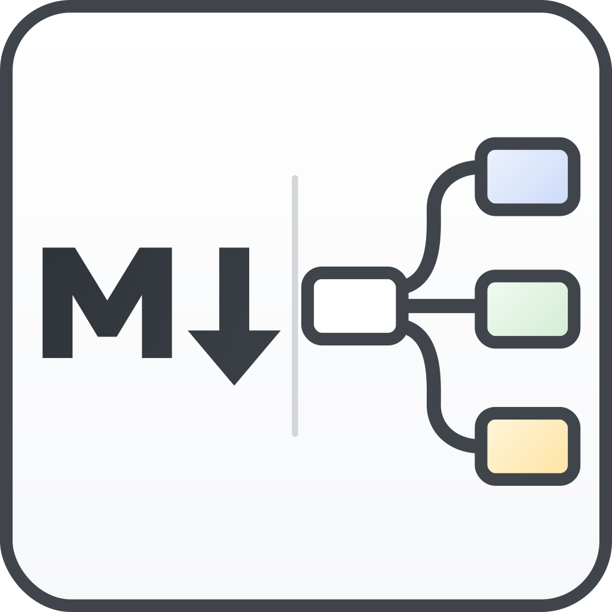
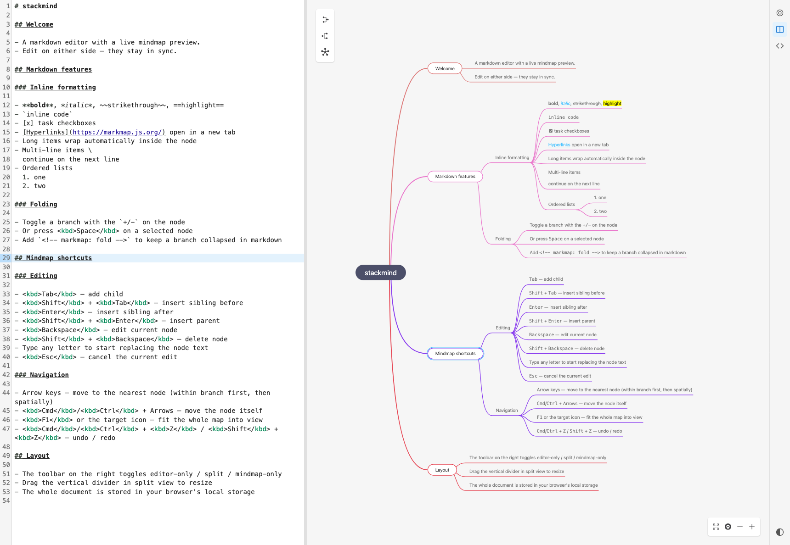

<div align="center">



# StackMind

Markdown editor with a live mindmap preview. Edit on either side — they stay in sync.

**[Live demo →](https://kvaps.github.io/stackmind/)**

<picture>
  <source media="(prefers-color-scheme: dark)" srcset="docs/screenshot-dark.png">
  <source media="(prefers-color-scheme: light)" srcset="docs/screenshot-light.png">
  
</picture>

</div>

## Highlights

- **Bidirectional sync** between a CodeMirror 6 markdown editor and a [mind-elixir](https://github.com/SSShooter/mind-elixir-core) mindmap.
- **Surgical markdown edits** — operations from the mindmap (rename, add, remove, move, fold) translate to minimal line patches via [markmap-lib](https://github.com/markmap/markmap) source maps, preserving frontmatter, inline formatting, code blocks, tables and images that surround edited nodes.
- **[markmap](https://markmap.js.org/) format**: headings, lists, multi-line items, fold comments (`<!-- markmap: fold -->`), checkboxes, links, frontmatter.
- **Hierarchical arrow navigation** with spatial fallback and per-parent last-child memory.
- **Light / dark / auto theme** kept in sync across editor, mindmap and chrome.
- **Resizable split view** with persisted ratio, three view modes, full document persisted in `localStorage`.

## Hotkeys (inside the mindmap)

| Key | Action |
| --- | --- |
| <kbd>Tab</kbd> | Add child |
| <kbd>Shift</kbd> + <kbd>Tab</kbd> | Insert sibling before |
| <kbd>Enter</kbd> | Insert sibling after |
| <kbd>Shift</kbd> + <kbd>Enter</kbd> | Insert parent |
| <kbd>Backspace</kbd> | Edit current node |
| <kbd>Shift</kbd> + <kbd>Backspace</kbd> | Delete node |
| Letter / digit | Replace text and start editing |
| <kbd>Esc</kbd> | Cancel edit |
| <kbd>Space</kbd> | Collapse / expand |
| Arrows | Navigate (siblings first, then nearest spatially) |
| <kbd>Cmd</kbd>/<kbd>Ctrl</kbd> + Arrows | Move the node itself |
| <kbd>Cmd</kbd>/<kbd>Ctrl</kbd> + <kbd>Z</kbd> / <kbd>Shift</kbd> + <kbd>Z</kbd> | Undo / redo |
| <kbd>F1</kbd> | Fit map to view |

## Quick start

```bash
pnpm install
pnpm dev
```

Opens on <http://localhost:5174/>. Production build with `pnpm build`.

## Stack

- Vue 3 + Vite + TypeScript
- Pinia for state and persistence
- CodeMirror 6 (`@codemirror/lang-markdown`, `@codemirror/theme-one-dark`)
- `mind-elixir` for the mindmap canvas
- `markmap-lib` (with `pluginSourceLines`) for parsing markdown with accurate line ranges
- `markdown-it` for syntax highlighting and tokens

## License

[MIT](LICENSE)
